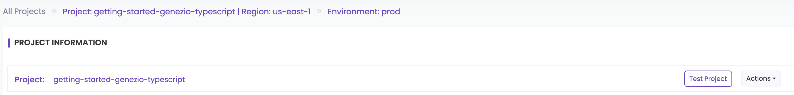

# Create your app starting from a template

### Prerequisites:

* A genezio account
* [Node.js](https://nodejs.org/en/download/current) >= 16
* [Npm](https://docs.npmjs.com/downloading-and-installing-node-js-and-npm)
* [Genezio CLI](create-your-first-project.md#getting-started) >= 0.7.3
* Any browser


The`genezio`command is available for versions >= 0.7.3.&#x20;


Go through the following tutorial to learn how you can use the `genezio` command to create your new Genezio Project interactively, starting from a template designed by our team.

This tutorial will show you how to create a new project based on the **Weather App** fullstack templates. After reading this tutorial you can **choose any other templates** that are prompted in our interactive interface, without you being limited to the Weather App template.

We encourage you to play with this interactive feature that should easily guide you through our template collection.

1. Navigate to a folder where you would like to create your new project. This folder should not be another genezio project folder. Run the `genezio` command:

```
genezio
```

2. A menu will open in your terminal that will prompt you to select the `Create a new project from a template` option. Your terminal should look like this:

```
$ genezio
? No genezio project in the current folder. What would you like to do?
❯ Create a new project from a template
  Cancel operation
```

3. From now on, you will be prompted to answer some questions that will shape how your new project will be configured.\
   \
   Firstly, let's choose a name for your project. We recommend you to name it `weather-app` for now.

```
? Please enter a project name: weather-app
```

4. Now let's choose the region where your code will live after deployment. We recommend choosing a region close to your application clients to reduce latency. If this is a personal project, just choose the closest location to you.

```
? Choose a region for your project (Use arrow keys)
❯ US East (N. Virginia)
  US East (Ohio)
  US West (N. California)
  US West (Oregon)
  Asia Pacific (Mumbai)
  Asia Pacific (Osaka)
  Asia Pacific (Seoul)
  Asia Pacific (Singapore)
  Asia Pacific (Sydney)
  Asia Pacific (Tokyo)
  Canada (Central)
  Europe (Frankfurt)
  Europe (Ireland)
  Europe (London)
  Europe (Paris)
  Europe (Stockholm)
  South America (São Paulo)
```

5. In the following step, you are prompted to choose the type of project you want to create. The popular choice here is to create and later deploy both the backend and the frontend at the same time to simplify the development and deployment process.\
   \
   We will continue with this option, but if you decide to choose another project type, the following steps should continue to apply to you.

```
? What type of project would you like to create? (Use arrow keys)
❯ Backend + Frontend (Fullstack)
  Backend
  Frontend
```

6. The following step applies only if you choose to create a `Fullstack` app and it requires you to choose the folder structure for your git repositories. Choose `Monorepo` if you are unsure what option is best for you.

<pre><code><strong>? What project structure would you like to use? (Use arrow keys)
</strong>❯ Monorepo (Frontend and backend in the same git repository - choose this if unsure)
  Multirepo (Frontend and backend in separate git repositories)
</code></pre>

7. You are now prompted to choose your backend language and then a template depending on what language you chose. Choose `TypeScript` - `Basic Weather App`

```
? Select your desired Backend language: (Use arrow keys)
❯ TypeScript

? Select your desired TypeScript template:
❯ Basic Weather App
  Blank TypeScript Backend
```

8. The same questions apply to your frontend app. Choose `TypeScript` - `React-Tailwind Weather App`.

```
? Select your desired Frontend language: (Use arrow keys)
❯ TypeScript

? Select your desired TypeScript template: (Use arrow keys)
❯ React-Tailwind Weather App
```

These were the last questions, and now, in less than 3 minutes your project was crafted to your liking.

As the shown prompt says, now you have 2 options:

* Deploy your code to the Genezio Cloud
* Test it locally before deploying

```
Project initialized in (your path)/weather-app.

    For deployment of both frontend and backend, run:
        cd weather-app
        genezio deploy


    For testing locally, run:
      Terminal 1 (start the backend):
        cd weather-app
        genezio local

      Terminal 2 (start the frontend):
        cd weather-app/client
        npm install
        npm run dev
```

9. Let's deploy the fullstack application and check it live in production, it should take under a minute. \
   \
   If you don't have a genezio account, you will be redirected to create one before your deployment starts.

```
$ cd weather-app
$ genezio deploy

Your backend project has been deployed and is available at https://app.genez.io/project/(project id)/(env id)
Frontend successfully deployed at https://(your app id).app.genez.io
```

10. Take the frontend link `https://(your app id).app.genez.io` from your terminal and open it in your favorite browser. You should see your application live, deployed in less than 5 minutes, looking like this:

<figure><figcaption><p>Genezio Starting Page</p></figcaption></figure>

This web application lets the users check the weather in a custom location by using the search bar up top. Also, it provides a bookmark feature for the user's favorite cities located left side.

<figure><figcaption><p>Genezio Weather App</p></figcaption></figure>

Congratulations! You have created and deployed a functional weather app in less than 5 minutes using Genezio.

It is that easy!

Now that you got a taste of our easy-to-use service, we recommend you start trying to build your app from scratch by using the `Blank TypeScript Backend` and `Blank TypeScript React Frontend` templates.

Happy coding!

### Next steps

Next, you can check out the following sections to get more in-depth details on the core features of genezio:

* See how you can easily [test your project locally](../features/testing.md).
* See [Project Structure](../project-structure/) section for details on how to tailor genezio to your needs.
* See other examples deployed with genezio in our [repository](https://github.com/genez-io/genezio-examples).
